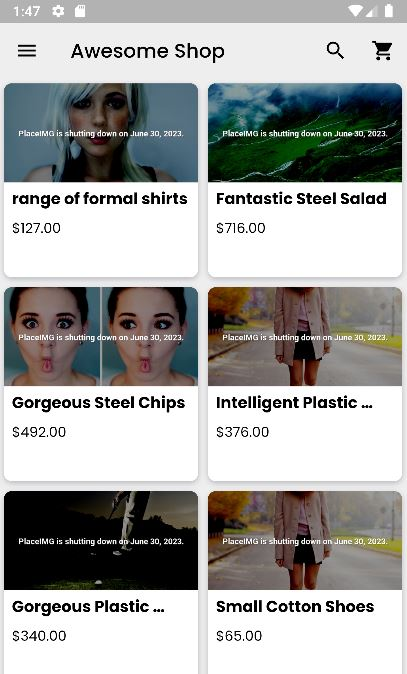

# E-commerce Mobile App

## Preview



## Why I created this project

I have build this mobile app to enhance my skills as a software engineer. I have always wanted to try the mobile field, and this came as a oportunity for me to test myself.

## How to run this project

This project was made using Flutter, Node.js and MongoDB.
Meaning that, if you want to run this project, you'll have to have Node.js installed in your machine as long as MongoDB, and Flutter.

### Enviroment Variables
```
Change the name of all files .env.example to .env
Client:
Note that the client has two enviroment variables. It needs the server API and the provider API.
You don't need to touch the url for the PROVIDER_API, but change the port number for SERVER_API to match the port number of the server that you are going to settle.

Server:
Update DB_URI and PORT to the matching url and port number of your mongoDB database.
WARNING: don't put the DB_URI as "mongodb://localhost:27017/example" because that will throw an error. Change to "mongodb://127.0.0.1:27017/example"
The secret is just a password for JWT authentication. You don't need to change it if you want to run this project.
```

### Running the app

```
First of all, correctly configure the Flutter development environment on your machine, see https://flutter.dev/docs/get-started/install

- Clone this repository:
$ git clone https://github.com/andersonrbernal/ecommerce-app.git

- Enter in the client directory:
$ cd client

- For install dependencies:
$ flutter pub get

- Run the app:
$ flutter run
```

### Running the server
```
- Enter in the server directory:
$ cd server

- Installing the dependencies:
$ npm install

- Running the server:
$ npm run dev
```

### Running the database
```
Firstly, go to MongoDB website to download MongoDB Compass.
You'll need it for the project to run correctly. 

https://www.mongodb.com/try/download/compass
```
